# Preamble

La repository è pensata per tenere traccia in maniera riproducibile
dei dati ottenuti e per tracciare le modifiche dei risultati derivanti
da diversi approcci e modifiche al fitting.

La branch `master` contiene dati, plot e fitting aggiornati all'ultimo incontro. 
La branch `fixed-background-peak-fit` contiene i dati aggiornati con la modifica sul range in X e sul bg costante.

Di seguito tutti i plot XRD, fitting e risultati ottenuti.

# Risultati e analisi

## Cristallinity

Di seguito i plot considerando prograssivamente tutti i picchi tranne l'amorfo (7).

### 1

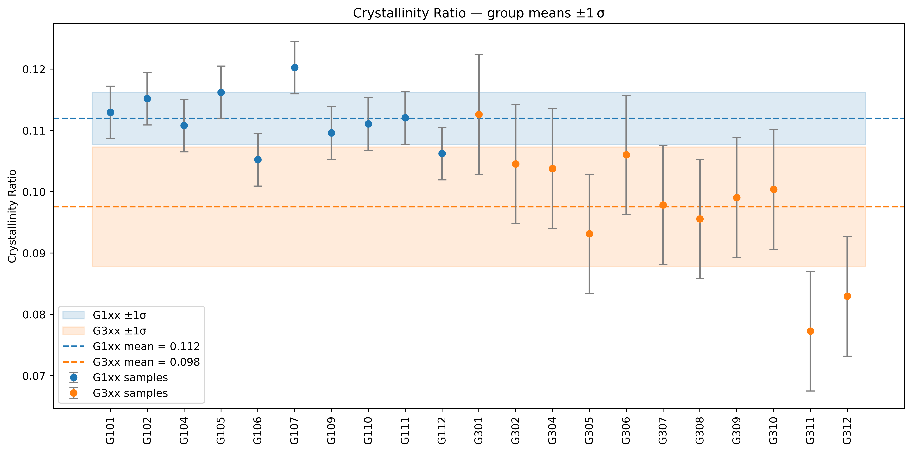

### 2

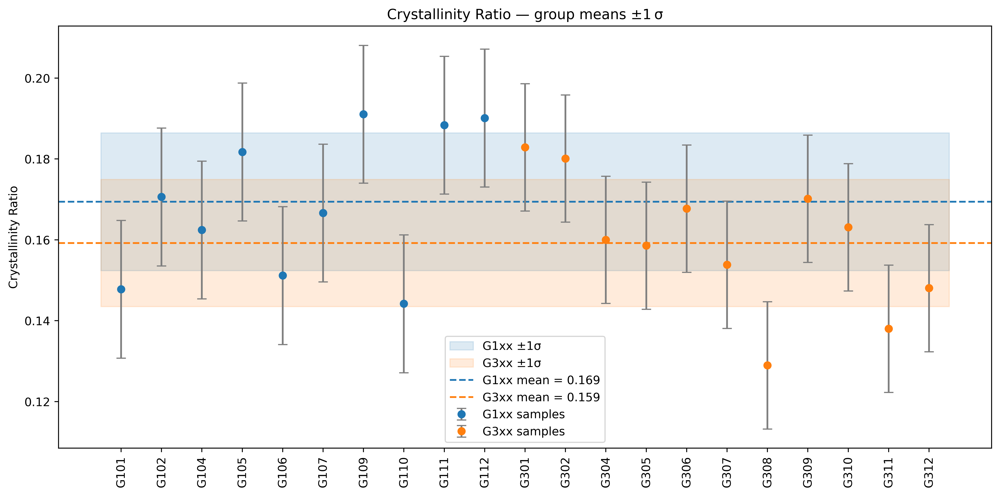

### 3

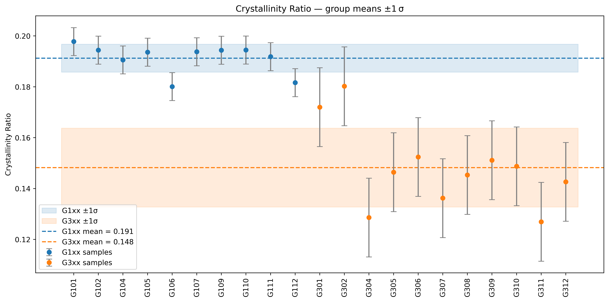

### 4

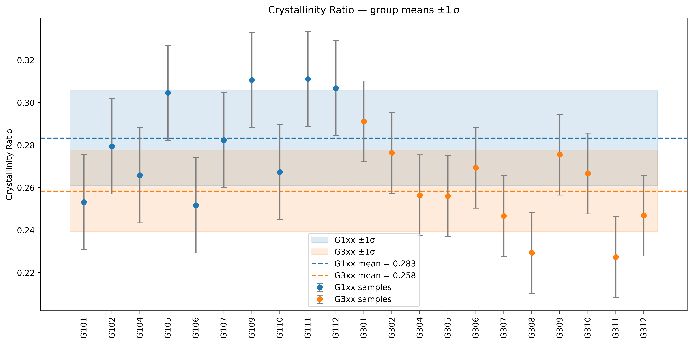

### 5

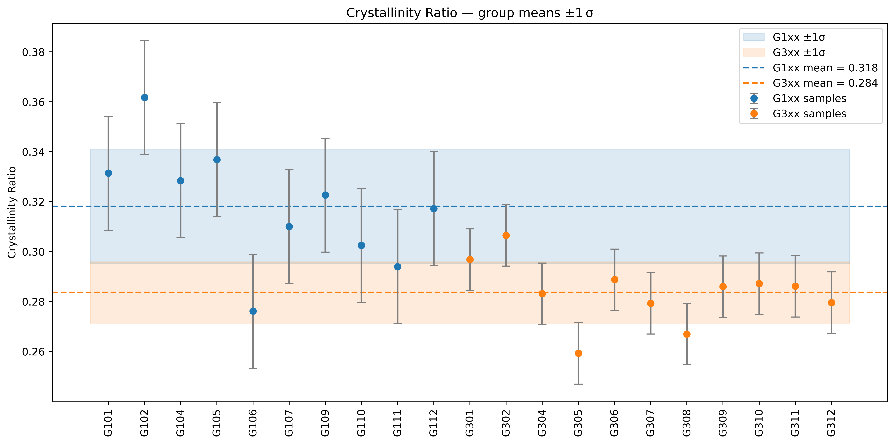

### 6

## Drifts

Andamento della posizione dei picchi, FWHM, ed intensità rispetto nei fitting dei diversi campioni

### Peak position drift

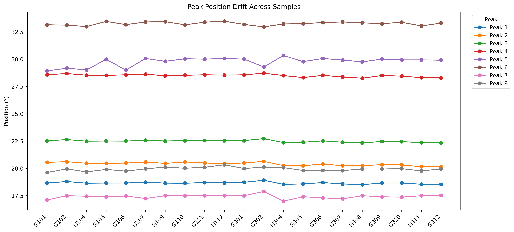

### FWHM drift

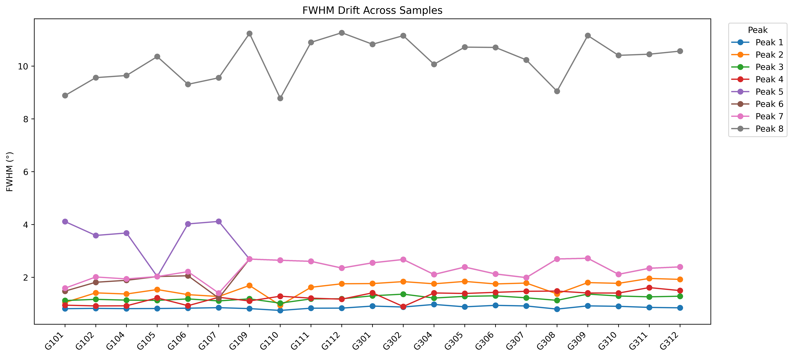

### Intensity drift

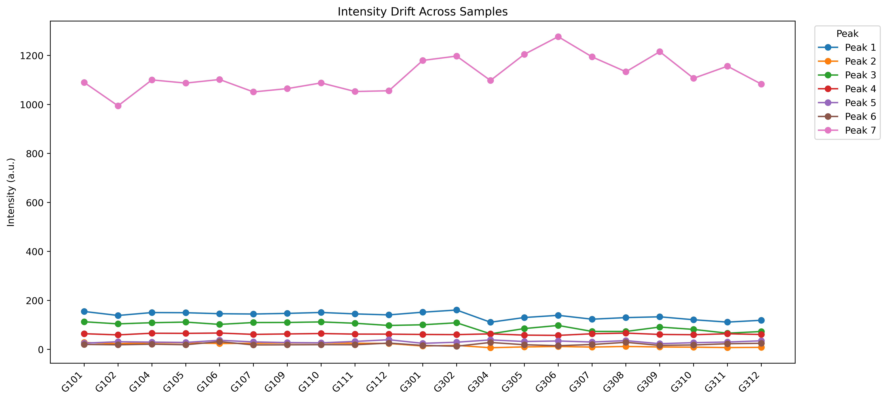

## Scatter

Andamento di intensità, FWHM, e posizione rispetto a ciascun picco in ciascun campione.

### Intensity vs cristallinity

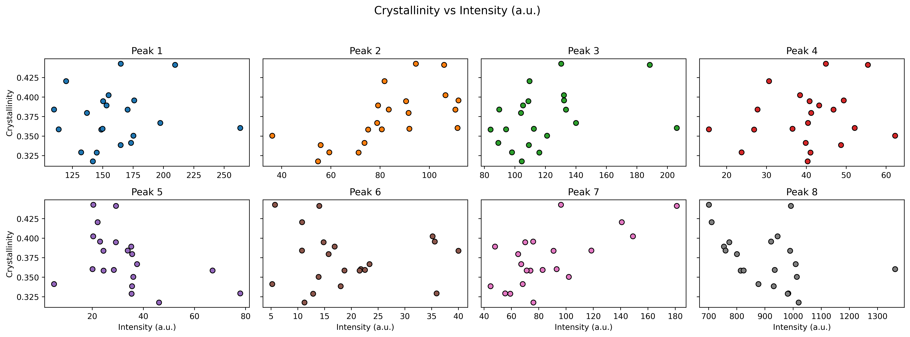

### FWHM vs cristallinity

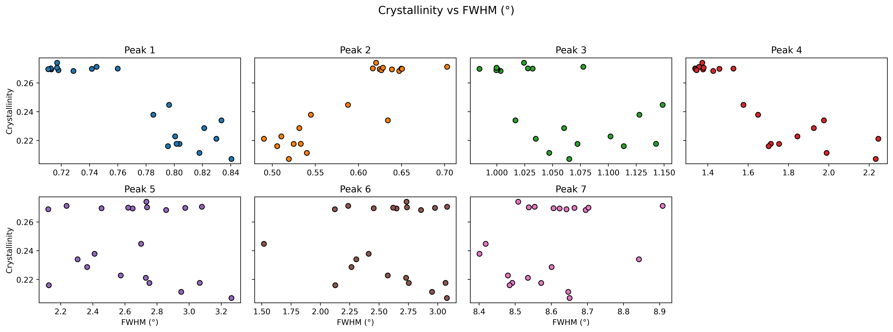

### Position vs cristallinity

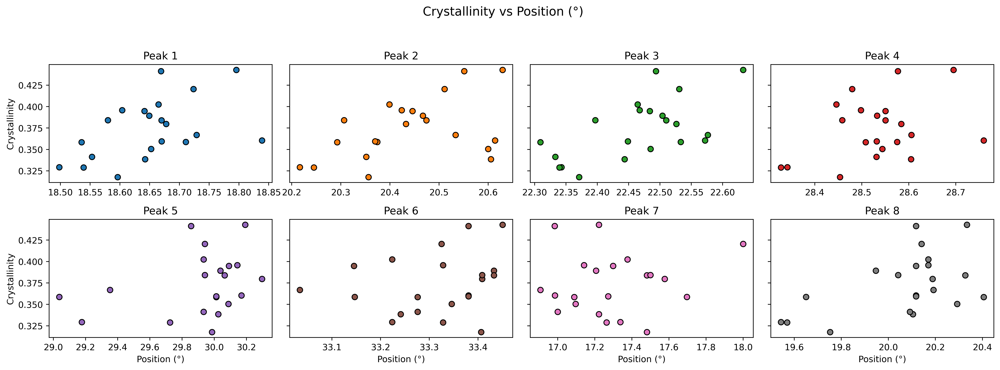

# Peak Fitting

## Gruppo profilo amorfo

## Gruppo profilo cristallino

# XRD

## Background

## Gruppo profilo cristallino

## Gruppo profilo amorfo

## Sovrapposti

