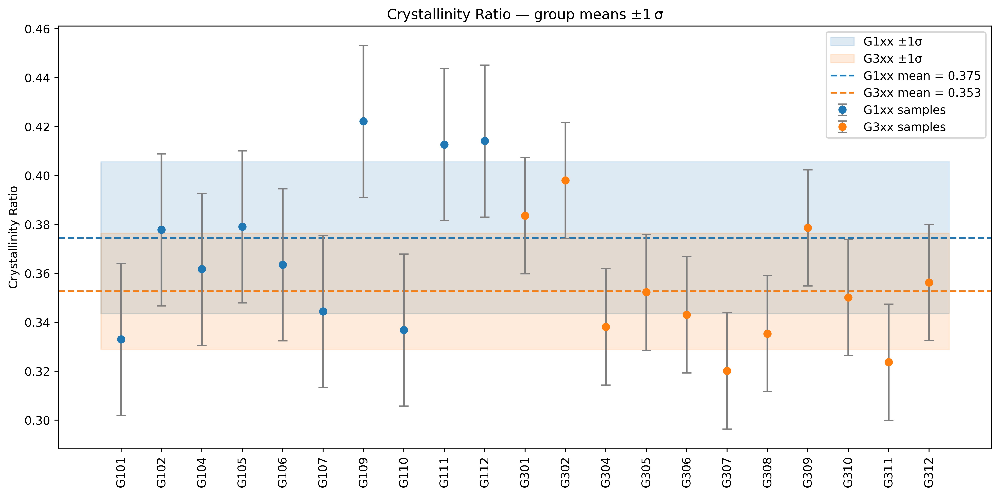
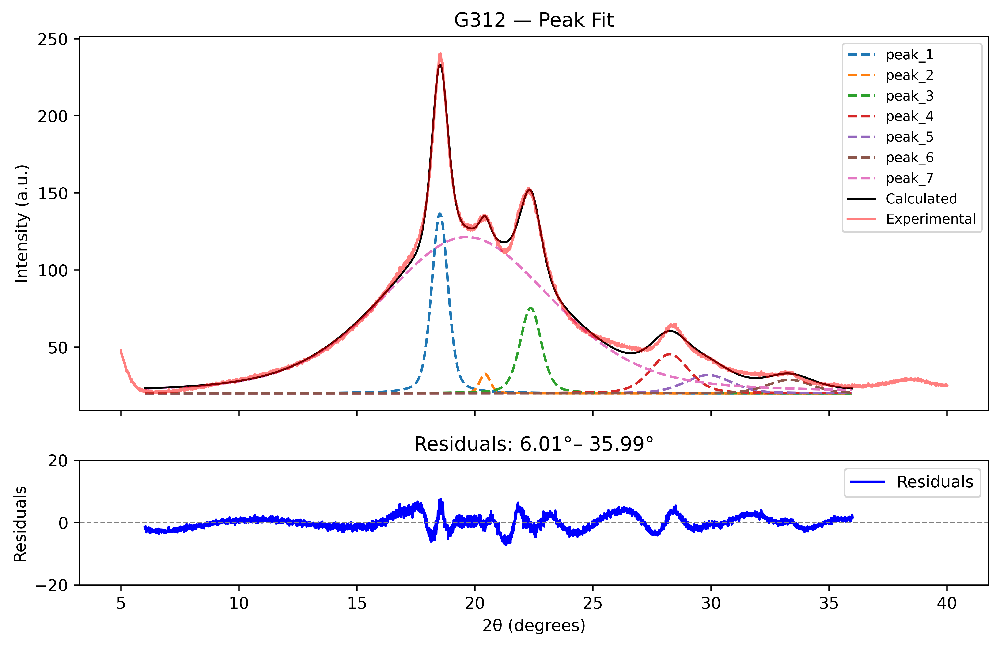
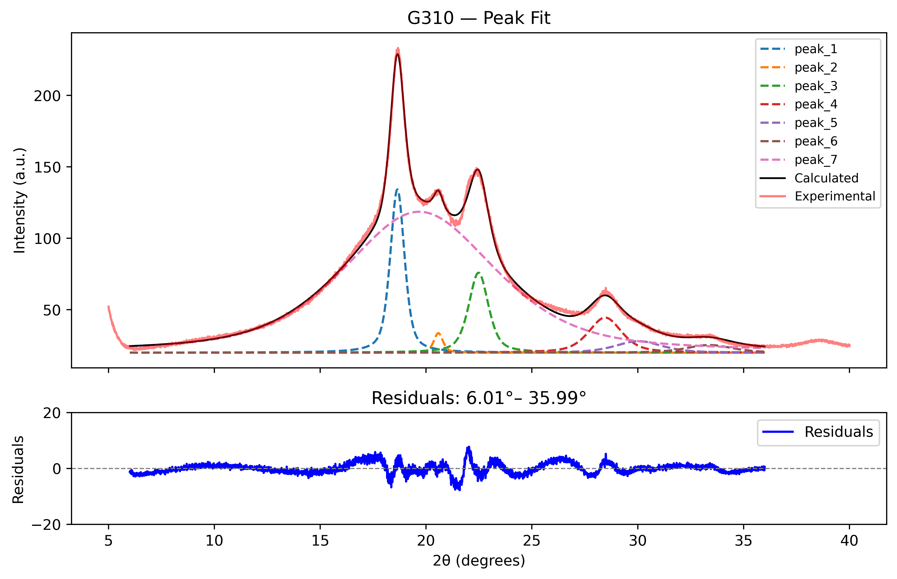
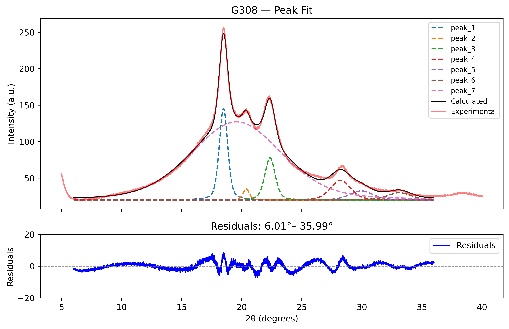
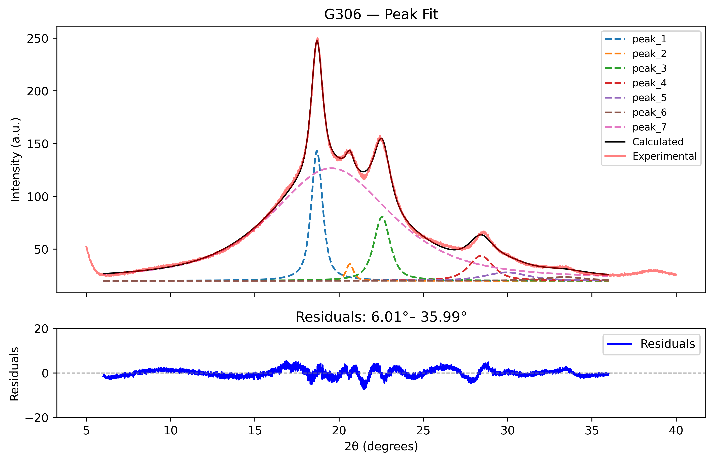
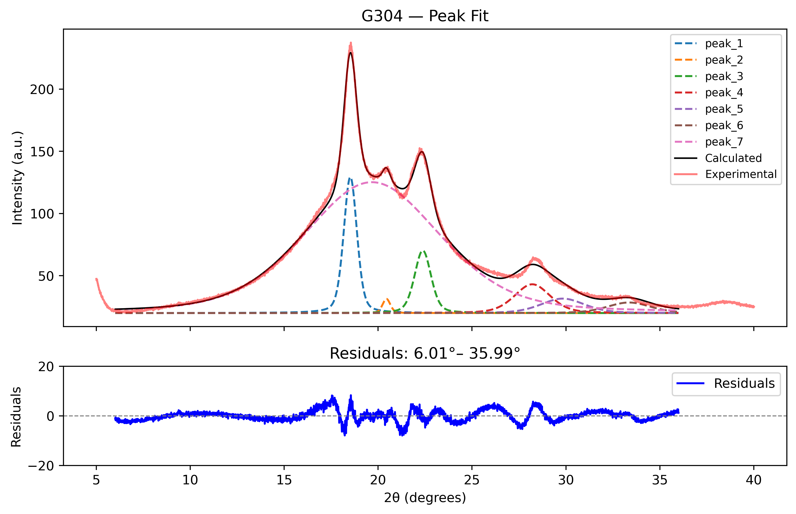
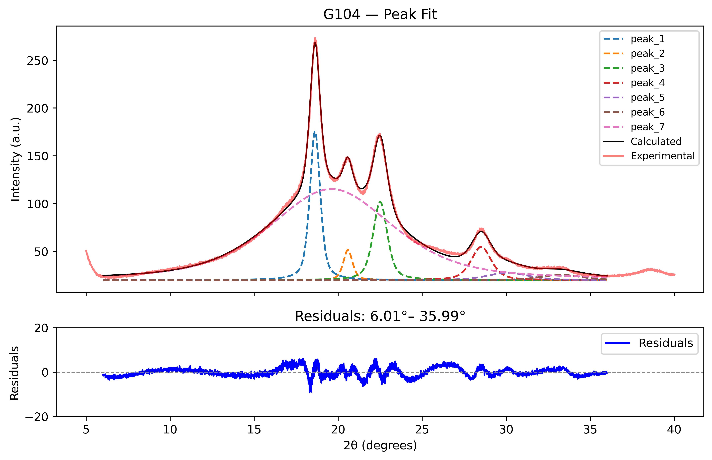
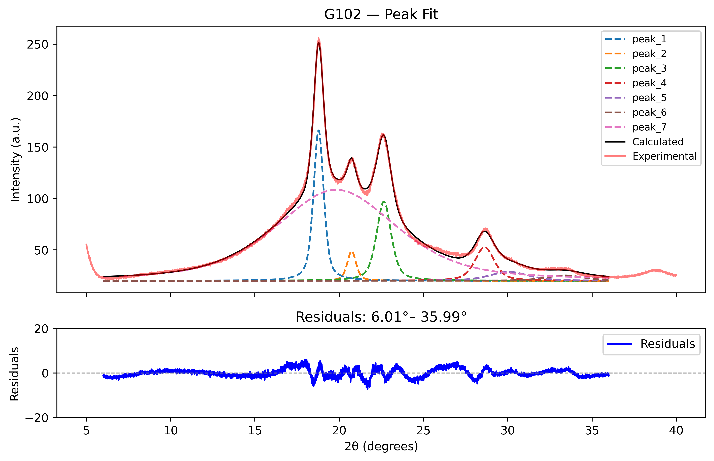
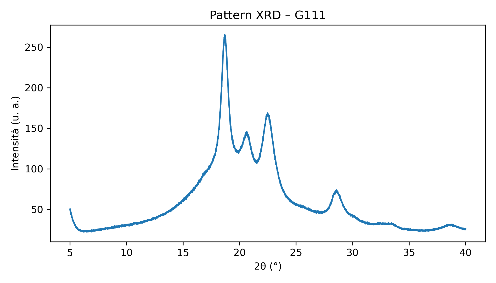

# Preamble

La repository è pensata per tenere traccia in maniera riproducibile dei dati ottenuti e per tracciare le modifiche dei risultati derivanti da diversi approcci e modifiche al fitting. 

La branch `master` è quella che viene mantenuta aggiornata con le ultime modifiche effettuate. 
Le altre hanno nome e descrizione esplicative.

Di seguito tutti i plot XRD, fitting e risultati ottenuti.

# Risultati e analisi

## Cristallinity

## Peak position drift

## FWHM drift

# Peak Fitting

# XRD

